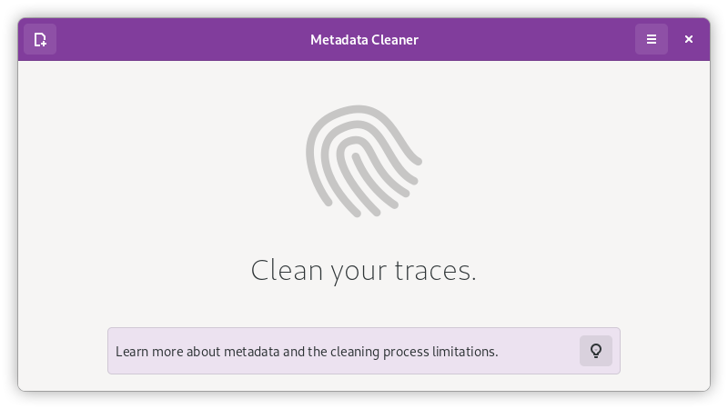
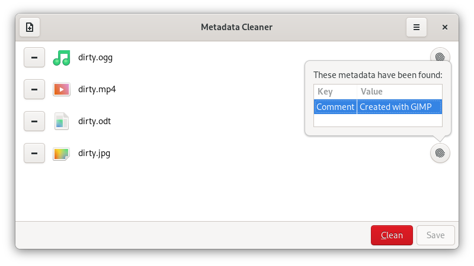
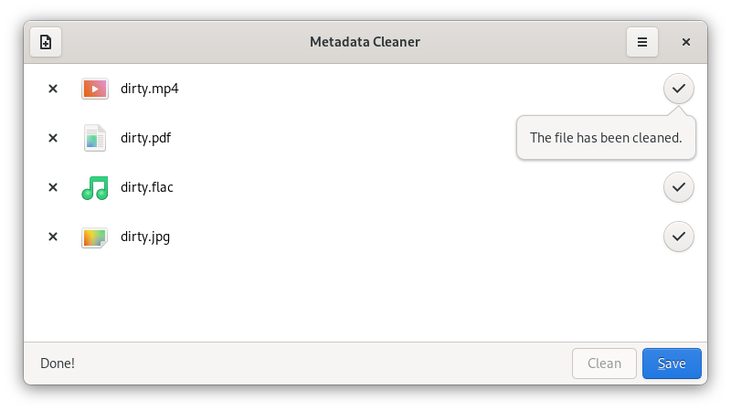
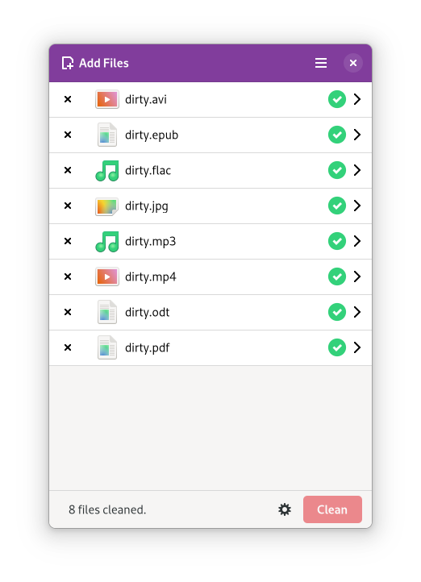

<!--
SPDX-FileCopyrightText: 2020, 2021 Romain Vigier <contact AT romainvigier.fr>
SPDX-License-Identifier: CC-BY-SA-4.0
-->

# Metadata Cleaner


Metadata within a file can tell a lot about you. Cameras record data about when a picture was taken and what camera was used. Office applications automatically add author and company information to documents and spreadsheets. Maybe you don't want to disclose those informations.

This tool allows you to view metadata in your files and to get rid of them, as much as possible.

Under the hood, it relies on [mat2](https://0xacab.org/jvoisin/mat2) to parse and remove the metadata.

---

[[_TOC_]]

---

## Screenshots






## Installing

Metadata Cleaner is available as a Flatpak on Flathub:

<a href="https://flathub.org/apps/details/fr.romainvigier.MetadataCleaner"></a>

## Building from source

Dependencies:

- `gtk4` >= 4.0
- `libadwaita-1`
- `pygobject-3.0`
- `python3`
- Python 3 `libmat2` module and [its dependencies](https://0xacab.org/jvoisin/mat2#requirements)

Metadata Cleaner uses the meson build system:

```sh
meson builddir
meson install -C builddir
```

Flatpak building is also available and requires the GNOME platform and SDK runtimes:

```sh
flatpak-builder --force-clean --user --install builddir build-aux/fr.romainvigier.MetadataCleaner.yaml
```

## Contributing

You can contribute to the documentation, translation or code, see [`CONTRIBUTING.md`](./CONTRIBUTING.md).

## Support

I've written this application for the benefit of everyone, if you want to help me in return, please consider [supporting me on Liberapay](https://liberapay.com/rmnvgr/)!

[](https://liberapay.com/rmnvgr/donate)
